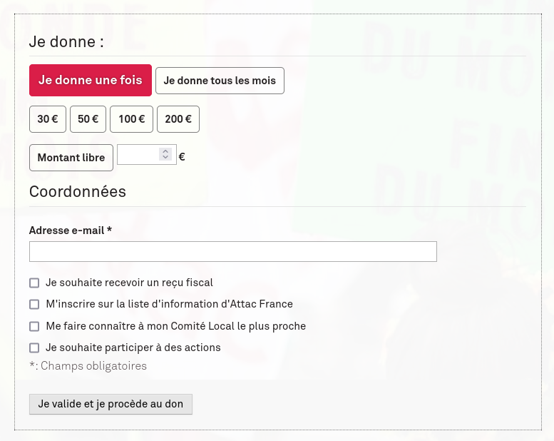
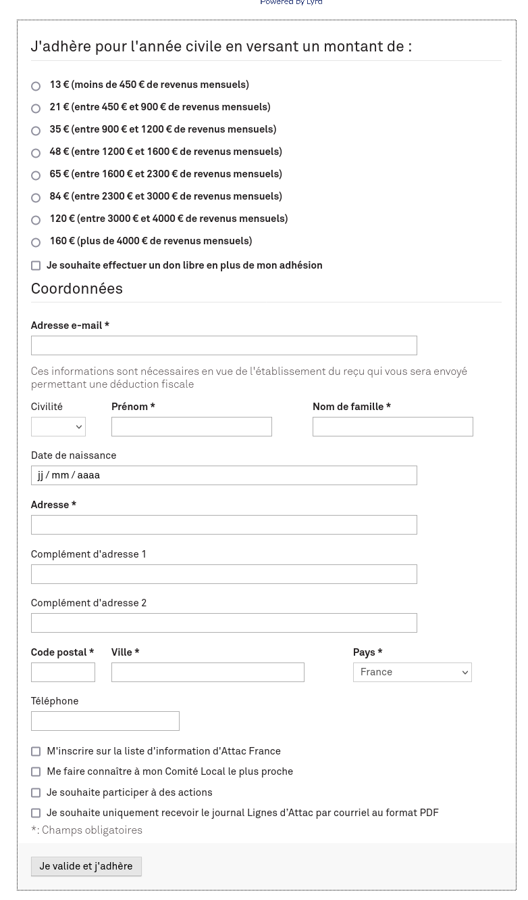
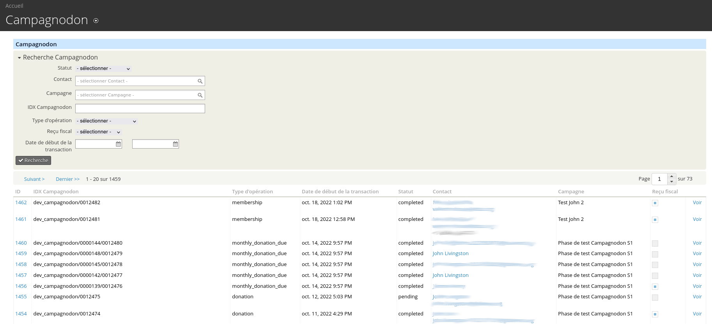
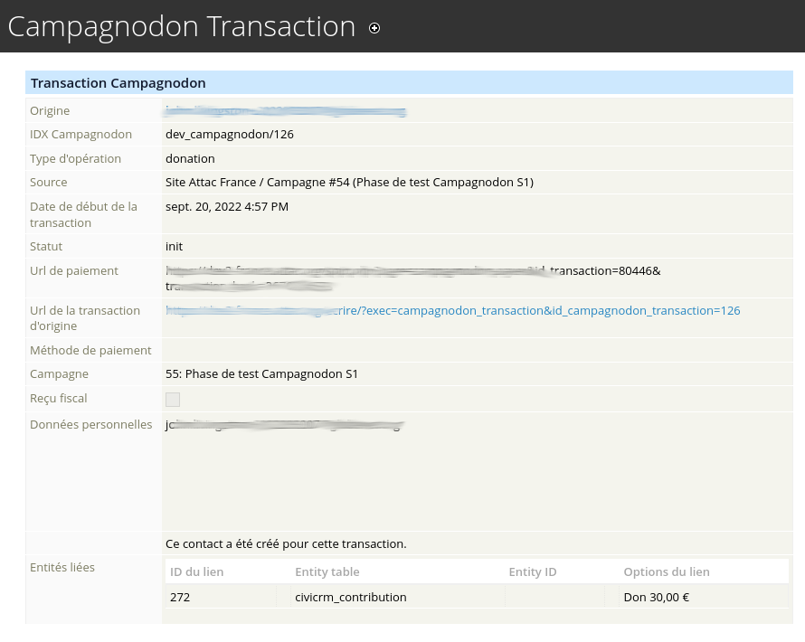

+++
title="Fonctionnel"
chapter=false
weight=20
+++

## Formulaires de dons et adhésion

Le plugin SPIP Campagnodon permet d'inclure dans des articles SPIP des formulaires de dons ou d'adhésions:

Ces formulaires sont hautement configurables, aussi bien au niveau de l'installation complète, que article par article:

* choix des montants proposés
* proposer les dons mensuels ou non
* proposer la saisie d'un don à montant libre
* on peut configurer et ajouter autant d'options «opt-in» que l'on veut

{}
  Attention, Campagnodon ne gère pas la partie bancaire. Il vous faut utiliser le plugin [SPIP Bank](https://github.com/nursit/bank>),
  et le configurer pour faire appel à un prestataire bancaire.
{}

## Système distant

Les données personnelles ne sont pas stockées coté SPIP, elles sont envoyées dans un système distant, qui peut ne pas être accessible publiquement.

Cela permet de compartimenter et sécuriser les données.

À l'origine, ce projet a été conçu avec une extension CiviCRM [Campagnodon CiviCRM](https://code.globenet.org/attacfr/campagnodon_civicrm).
Mais les API de communication entre ces deux systèmes sont standardisées, et il est possible de mettre d'autres systèmes en lieu et place de CiviCRM (à condition de développer les connecteurs adéquates).

{}
  Si vous souhaitez utiliser Campagnodon avec autre chose que CiviCRM (ou même autre chose que SPIP), n'hésitez pas à contacter
  [John Livingston](https://www.john-livingston.fr). Vous pouvez par exemple passer par les gestionnaires de tickets de l'un des dépots de code
  référencé sur ce site web (voir dans le menu gauche).
{}

### CiviCRM

Coté CiviCRM, l'extension Campagnodon CiviCRM vient avec une application permettant de suivre les «transactions Campagnodon».
Elle fourni également des API dédiées, qui permettent de:

* créer des contributions
* créer ou prolonger des adhésions
* dédoublonner automatiquement les contacts
* gérer les options présentes dans le formulaire (par ex: accepter d'être démarché, être ajouté à des groupes, etc...)

On peut alors retrouver dans CiviCRM l'historique complet des données venant de Campagnodon.

Et pour chaque transaction, son détail:

* le contact
* les données personnelles saisies
* les contributions crées
* les adhésions crées
* les groupes dans lesquels le contact a été ajouté
* ...

